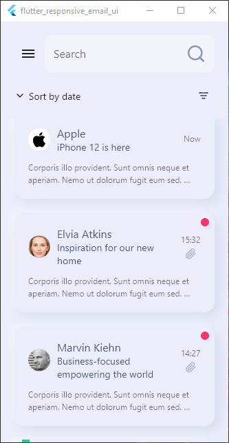
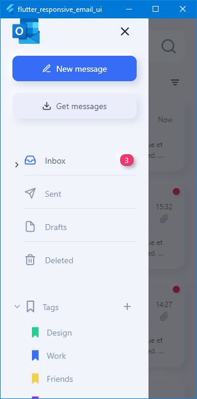
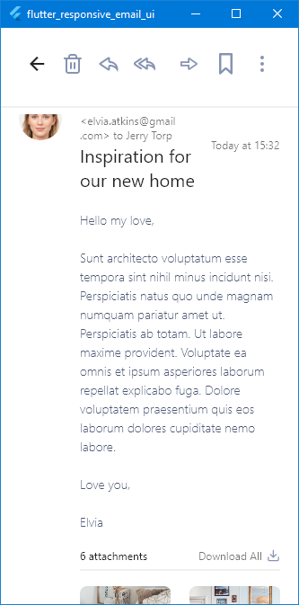

# # Outlook App Redesign

An Flutter Fully Responsive Design UI Outlook inspired.

## Project Status

This project is just a personal showcase, done with de aim of register what i have studied, and show my skills. It may receives improvements in the future.

## Project Screen Shots

| Home Page                         | Drawer                              | Details                              |
| --------------------------------- | ----------------------------------- | ------------------------------------ |
|  |  |  |

| Layout Responsiveness                       |
| ------------------------------------------- |
|  |

## Installation and Setup Instructions

Clone down this repository. You will need `Flutter` and `Dart` installed globally on your machine.

Installation:

`flutter pub get install` on the project root.

To Run the android application:

`flutter run -d <device or emulator id>`

To build a android release:

`flutter build apk` the package will be generated on **./build/app/outputs/flutter-apk/app-release.apk**
